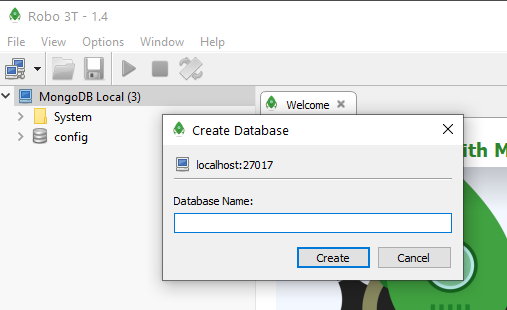
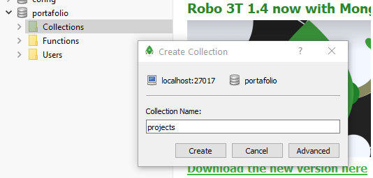
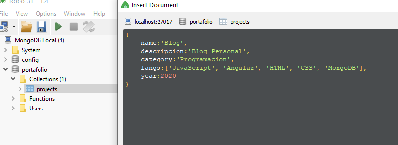

# Mongo
En este repositorio repaso teoría y ejercicios de Mongo DB (bases de datos no SQL) que quedan reflejados en este archivo README.md.

El contenido se ha redactado mientras cursaba el [Master en JavaScript: Aprender JS, jQuery, Angular, NodeJS](https://www.udemy.com/course/master-en-javascript-aprender-js-jquery-angular-nodejs-y-mas/) de Víctor Robles, por lo que la mayor parte del contenido ha sido codificado siguiendo sus indicaciones.

El código ha sido variado para adaptarlo a mis preferencias personales y se han añadido conceptos  provenientes del  Bootamp de desarrollador web FullStack que he realizado en [Upgrade-Hub](https://pro.upgrade-hub.com/) así como de  de otras fuentes.

## INDICE

1. [NoSQL vs SQL](#id1)

2. [Instalación y archivos de uso](#id2)

3. [Comandos consola mongo.exe](#id3)

4. [Robo3t - RoboMongo](#id4)

5. [Crear una base de datos en Mongo](#id5)


## 1. NoSQL vs SQL<a name="id1"> </a>

SQL: 
* Son bases de datos relacionales
* Con tablas
* Con un esquema claro de relaciones
    * Las tablas se relacionan mediante indices
    * Se pueden hacer consultas, consultas multi-tablas
    * Claves primarias y claves foráneas
    * Todas las tablas tienen los mismos campos, mismas filas, mismas columnas, etc.
    
NoSQL
* Utilizamos JavaScript
* Bases de datos no relacionales, aunque se puede simular ese funcionamiento
* No tenemos tablas, tenemos colecciones de documentos
* Documentos son objetos bson(binary Jason - son JSON guardados en formato binario para procesar más rápido las operaciones)
* Documentos: pueden tener más documentos dentros, pueden tener mucha información embebida.
* VENTAJAS: Sencillo de trabajar con ello al no tener que pensar en las relaciones
    * documento artículos con subdocumentos comentarios, etiquetas, artículos relacionados.
    * Se pueden meter datos dentro de otros sin pensarlo mucho. 
    * Velocidad de consulta es muy rápida(más que en SQL)
    * Esquema libre: no tengo que tener un número determinado número de filas, columnas etc para relacionar documentos.
 

COMPARACIÓN:
* BBDD SQL
    * Filas
    * Columnas
    * Registros

* BBDD NoSQL
    * Tablas --> **Colecciones**
    * Filas --> **Documentos**
    * Columnas --> **Campos**
    * Registros --> **Datos del documento**

```json
Usuarios:
{
"nombre": "Ángel",
"apellidos": "garrido Álvarez",
"email": "angelo@angelosky.com"
},
{
"nombre": "Ángel",
"apellidos": "garrido Álvarez",
"email": "angelo@angelosky.com"
}
```
    

## 2. Instalación y archivos de uso<a name="id2"> </a>

1. Descargar el archivo e instalar 
[Guía Instalación](https://docs.mongodb.com/manual/tutorial/install-mongodb-on-windows/)

2. Crear carpeta C:\data\db donde vamos a guardar las BBDD

3. Archivos ejecutables  
    * Programa\MongoDB\Server\4.4\Bin\mongod.exe - the daemon
        * Se queda en segundo plano / modo demonio para que mongo funcione
        
    * Programa\MongoDB\Server\4.4\Bin\mongo.exe - the client
        * Consola de comandos
        * hacer consultas
        * crear bases de datos
        * 
4. Otras utilidades de Mongo
    
    * MongoDB Atlas
        * Cloud-hosted MongoDB service on AWS, Azure and Google Cloud.
        * Deploy, operate, and scale a MongoDB database in just a few clicks
    
    * Mongo Compass - Otra interface gráfica como Robot3t/RoboMongo
        * GUI - graphical user interface
        * Visually explore your data. 
        * Run ad hoc queries in seconds. 
        * Interact with your data with full CRUD functionality (Create, Read, Update and Delete). 
        * View and optimize your query performance.
        
    * Programa\MongoDB\Server\4.4\Bin\mongos.exe -  the 'MongoDB Shard Utility'.
        * Aplicación de gestión de shards (fragmentos)
        * A shard contains a subset of sharded data for a sharded cluster. Together, the cluster’s shards hold the entire data set for the cluster.

## 3. Comandos consola mongo.exe <a name="id3"> </a>
```shell script
> help
        db.help()                    help on db methods
        db.mycoll.help()             help on collection methods
        sh.help()                    sharding helpers
        rs.help()                    replica set helpers
        help admin                   administrative help
        help connect                 connecting to a db help
        help keys                    key shortcuts
        help misc                    misc things to know
        help mr                      mapreduce

        show dbs                     show database names
        show collections             show collections in current database
        show users                   show users in current database
        show profile                 show most recent system.profile entries with time >= 1ms
        show logs                    show the accessible logger names
        show log [name]              prints out the last segment of log in memory, 'global' is default
        use <db_name>                set current database
        db.mycoll.find()             list objects in collection mycoll
        db.mycoll.find( { a : 1 } )  list objects in mycoll where a == 1
        it                           result of the last line evaluated; use to further iterate
        DBQuery.shellBatchSize = x   set default number of items to display on shell
        exit                         quit the mongo shell
```


## 4. Robo3t - RoboMongo<a name="id4"> </a>

* MongoDB GUI with embedded shell
* Write queries in the embedded mongo shell
* View and edit documents in Table, Tree, or JSON View
* [Descargar e instalar](https://robomongo.org/)

### 4.1. Configurar una conexión a MongoDB

* Abrir Robo3T
* Pulsar 'Create'
    * Dar un connection name (en este caso la llamamos MongoDB-Local))
    * Poner el puerto deseado (por defecto es 27017)
    * Save
    * Connect


## 5. Crear una base de datos en Mongo <a name="id5"></a>

* Tenemos que tener abierto el "daemon" de mongo:
    * Programa\MongoDB\Server\4.4\Bin\mongod.exe
* Abrir Robo3T, y con nuestra configuración ya creada, elegimos la BBDD a la que nos vamos a conectar (en nuestro caso MongoDB-Local) y pulsamos 'Connect'.
* Pulsar sobre nuestra BBDD (MongoDB-Local) y elegir 'create database' (en nuestro caso la llamamos portafolio)


## 5.1. Crear colecciones

* Dentro de nuestra BBDD (portafolio) pulsar botón derecho sobre collection --> create collection: dar nombre (projects en nuestro caso)



* Creo documentos con el botón derecho pulsando sobre la colección
* Introduzco los datos en formato JSON



Ya puedo hacer consultas y visualizarlas en formato gráfico o en JSON si pulso sobre el icono correspondiente en la parte superior derecha de la ventana.
